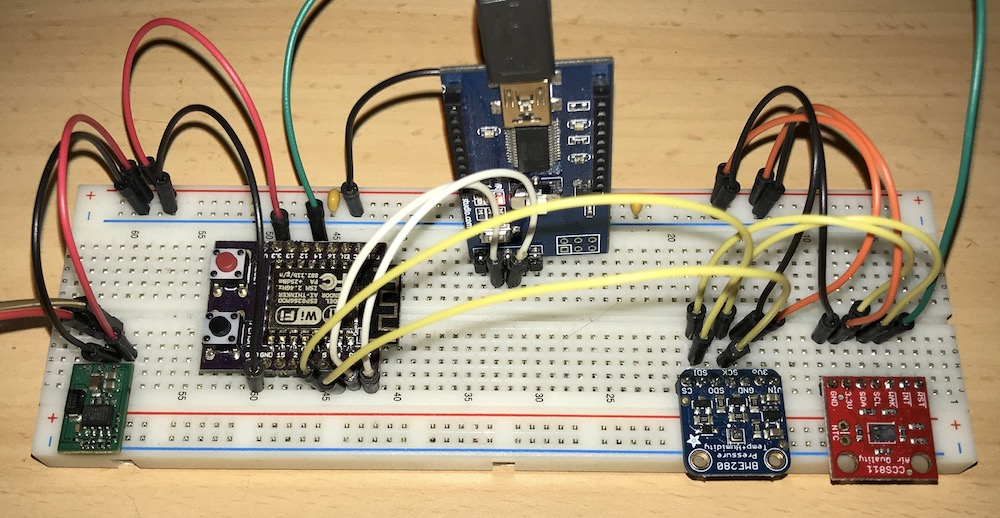

# ESP8266 MQTT CCS811/BME280 air quality sensor

This is a simple sketch to measure the air quality with the [CCS811 Air Quality Sensor](http://ams.com/eng/Products/Environmental-Sensors/Air-Quality-Sensors/CCS811). It get's compensated with an [Bosch BME280](https://www.bosch-sensortec.com/bst/products/all_products/bme280).

I use the @AKStudios [CCS811 library](https://github.com/AKstudios/CCS811-library), as I can't get the Sparkfun/Adafruit Libs to work on the ESP8266. I always get an `I2C_ERROR`, any help on that?

This lib compensates the CCS811 not through temperature and pressure but through temperature and humidity.

Currently I'm testing if my setup works and the values are reliable - so pleas see this as a work in progress.

__Any Feedback and help is appreciated!__

---




## Config
See the config section in the code, should be self-explaining :-)

The read data get's dropped to the following topics using `<mqtt-topic-prefix>`. All values are retained, the online state is set to `offline` using mqtt's last-will.

```
<mqttTopicPrefix>status          online/offline (last will)
<mqttTopicPrefix>ip              system ip
<mqttTopicPrefix>temperature     temperature in °C
<mqttTopicPrefix>humidity        relative humidity in %
<mqttTopicPrefix>pressure        pressure in hPa
<mqttTopicPrefix>altitude        altitude in m
<mqttTopicPrefix>co2             CO2 concentration in ppm
<mqttTopicPrefix>tvoc            total volatile compund in ppb
```


## Created with
- Arduino 1.8.1 (https://www.arduino.cc/)
- ESP8266 board definition 2.4.0 (https://github.com/esp8266/Arduino)
- PubSubClient 2.6.0 by Nick O'Leary (https://github.com/knolleary/pubsubclient)
- CCS811 from https://github.com/AKstudios/CCS811-library
- Sparkfun BME280 library from https://github.com/sparkfun/SparkFun_CCS811_Arduino_Library

### Credits
Patrik Mayer, 2018 

### License
MIT